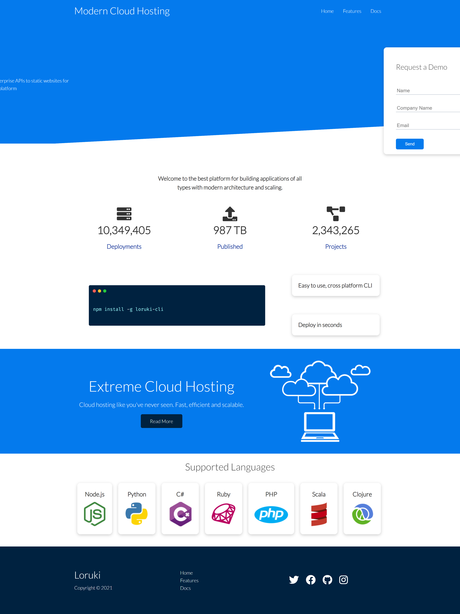
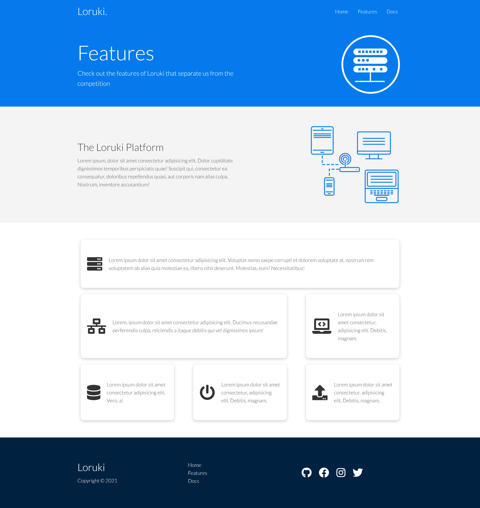
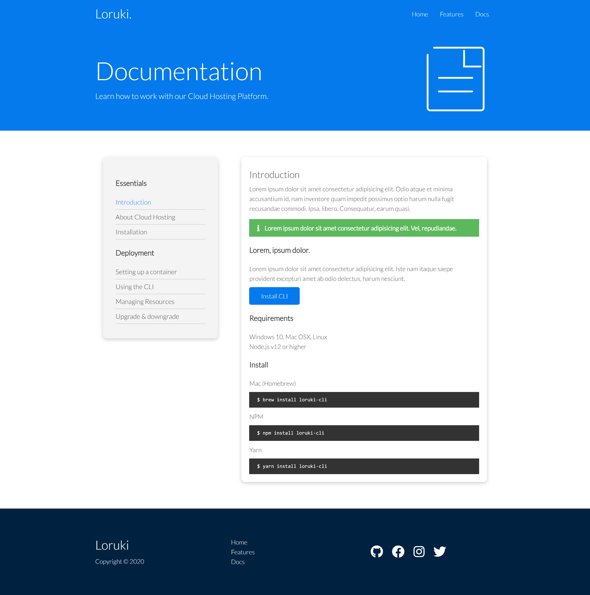

# HTML & CSS - Modern Reponsive Hosting Platform

### Live Demo:

https://h0sting.netlify.app/

### About:

This is a mock modern cloud hosting platform website similar to Heroku or Netlify, which features a
a robust and mobile-responsive splash page, a features page, and a documentation page.

A lot of really cool and cutting-edge CSS techniques were used, including flexbox and the grid system.

While building, we created a ton of reusable utility classes similar to what you would find in a CSS framework such as Bootstrap.

We also created some really slick animations to slide in various parts of the home page from off screen when a user connects.

### Screenshots:





### Relevant Code:

Skewed line across home page:

```

.showcase::before,
.showcase::after {
  content: "";
  position: absolute;
  height: 100px;
  bottom: -70px;
  right: 0;
  left: 0;
  background: #fff;
  transform: skewY(-3deg);
  -webkit-transform: skewY(-3deg);
  -moz-transform: skewY(-3deg);
  -ms-transform: skewY(-3deg);
}

```

some custom grid features for our CLI section:

```

.cli .grid {
  grid-template-columns: repeat(3, 1fr);
  grid-template-rows: repeat(2, 1fr);
}

.cli .grid > *:first-child {
  grid-column: 1 / span 2;
  grid-row: 1 / span 2;
}

.features-main .grid > *:first-child {
  grid-column: 1 / span 3;
}

.features-main .grid > *:nth-child(2) {
  grid-column: 1 / span 2;
}


```

Keyframe animations for the sliding in from off the screen:

```
@keyframes slideInFromLeft {
  0% {
    transform: translateX(-100%);
  }

  100% {
    transform: translateX(0);
  }
}

```

### Acknowledgement:

Thanks to Traversy Media for another AMAZING tutorial! Learned so much in this one. He really is the best teacher on YouTube.
